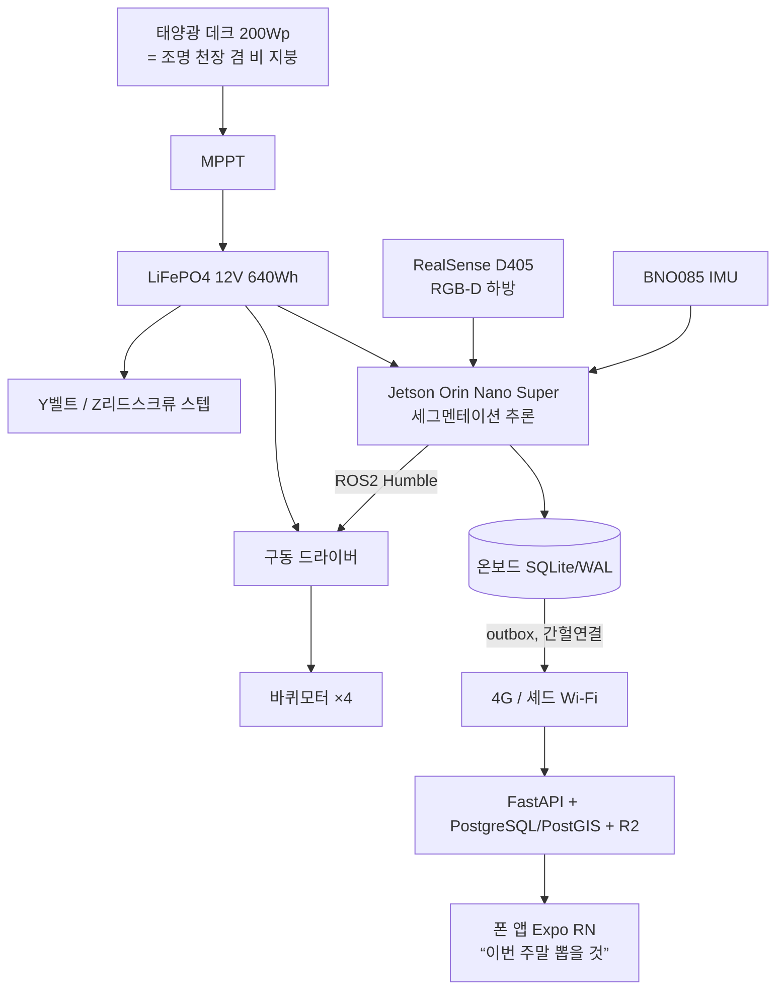

# weedwatch — 실물 제작 가능 설계 (Buildable Design)

> 이 문서의 목적: **실제 엔지니어가 이걸 보고 진짜 로봇과 서비스를 만들 수 있는 수준**의
> 부품·정격·아키텍처를 한곳에 모은다. 그리고 **시뮬이 증명하는 것 / 시뮬·데이터 한계로
> 실물에서만 되는 것**을 정직하게 가른다(§7 심-리얼 갭 원장).
>
> 결정 기록은 `docs/DECISIONS.md`, 시뮬 검증 상태는 `STATUS.md`. 이 문서는 그 위의
> **하드웨어/서비스 설계 목표**다. 코드(`tools/*`, `worlds/*`)는 이 중 시뮬로 검증 가능한
> 부분을 구현·단언한다. 미검증·실물전용 항목은 §7에 명시하고, 실물 제작 전 물리 프로토타입으로 메운다.
>
> 2026-07-20 종합 설계 패스(6 서브시스템 병렬)로 작성. 수치는 조사 기반이나 인용 전 재확인.

---

## 1. 한눈에

두둑 하나를 걸터탄 포탈 로봇 + 태양광 지붕 + 온보드 비전 + 폰/웹 관리 서비스.



**하드웨어 대략 총액: ~$2,900** (프로토타입 1대) + 서비스 **~$11/월**. 취미 규모·기성 부품 원칙
(라이다·RTK·헥타르급 부품 거부 — DECISIONS 001).

---

## 2. 기구·구조·액추에이터

| 부품 | 실제 스펙 | 근거 | ~$ |
|---|---|---|---|
| 크로스빔(Y 갠트리=레일) | OpenBuilds C-Beam 40×80 V-slot, 1.5m, Ix≈25cm⁴ | 구조=레일 통합(FarmBot). 처짐 δ≈0.1mm = ±2cm 의 1/200 | 50 |
| 다리 ×4 (clearance 0.60) | 4040 V-slot 0.60m + 허브모터 브래킷 | garden_geometry clearance 실현 | 60 |
| 데크 프레임 | 2040 V-slot + STS304 체결(용접 X, 재조립 가능) | 파라메트릭 유지 | 95 |
| **구동 모터 ×4** | ZLTECH 8″(216mm) 24V IP65 인휠 BLDC, 정격 4·피크 12 N·m, 엔코더 내장 | 최악 견인 13.2 N·m를 4WD로. sim diff-drive 그대로 실물화 | 600 |
| 구동 드라이버 | ZLTECH 듀얼 24–48V 30A (CAN/RS485) ×2 | /cmd_vel → 좌/우 속도 | 260 |
| **Y 캐리지 (±0.45m)** | V-Slot NEMA23 GT3 벨트 + IP65 클로즈드루프(±0.1mm) | 장행정엔 벨트(FarmBot). sim make joints를 하드웨어로 | 195 |
| **Z 도구 (0.35m)** | NEMA23 IP65 + Tr8×8 리드스크류, 추력 ~628N | 흙 3cm 관입(170–340N)에 2–3배 여유 | 150 |
| 점 타격 로드 | Ø12 STS304 봉, 원뿔 경화팁 | BoniRob 1cm 인용(009). 점 타격=선택적(013-5) | 15 |
| 태양광 데크 | Sunman eArc 유리프리 플렉시블 ~200W + Dibond 기판 | 유리 11 vs ETFE 2.6kg/m²(010). 광-카메라 상수화 | 180 |
| 방수·밀봉 | IP66 NEMA-4X 함 + IP68 글랜드 + 드래그체인 + Z 벨로우즈 | 상시 야외. 흙 유입이 최대 리스크 | 85 |

**미해결(§8)**: 실물 질량 ~35–45kg (sim 27kg 상회) → 구동·관성·배터리 재산정 / 저속 26rpm
직결 인휠 발열 / 젖은 유기토 견인·침하 / Y·Z 그릿 밀봉 / 데크 풍하중.

---

## 3. 센싱·컴퓨트·전장

| 부품 | 실제 스펙 | 역할 |
|---|---|---|
| **RGB-D 카메라 ×2** | Intel RealSense D405 (RGB+깊이 정렬, 1280×720@30, 작동 7–50cm, 87° FOV) **2대** | sim down_cam{0,1}+down_depth{0,1}. 근접역이 작업거리와 일치. 높이를 비전으로. **2대인 이유: 한 대는 두둑 위 0.33m 에서 0.585m 밖에 못 봐 90cm 두둑의 35%가 사각(DECISIONS 026)**. y=±0.225 배치, 겹침 0.135m |
| AprilTag 카메라 | RPi Global Shutter (IMX296) + 6mm 렌즈 | 코너 태그 위치추정 L3 |
| IMU | Bosch BNO085 (온보드 센서퓨전, 쿼터니언 직출) | sim imu 승격. /robot/imu |
| 타격 검출 | TMC2209 StallGuard4 (또는 로드셀) | 막대가 흙 저항 만나면 부하값 급변 |
| 전력 모니터 | INA226 (I2C, 24V 버스) | 에너지 원장 + 스톨 |
| **온보드 컴퓨터** | NVIDIA Jetson Orin Nano Super 8GB (67 TOPS, 7–25W, $249) | 세그멘테이션 실시간 추론 |
| 실시간 MCU | Teensy 4.1 + micro-ROS | 스텝/엔코더/센서 프론트엔드 |
| AprilTag 말뚝 ×4 | 36h11 태그 100–150mm, UV 라미네이트 | 두둑 네 귀퉁이 위치 기준 |

**미해결(§8)**: sim 카메라 intrinsic(640×480/60°/0.145m)을 **D405(1280×720/87°)에 맞춰 재보정**해야
sim-to-real px/cm 주장이 유효. IMU 지자기 교란(모터 근처) → gyro+AprilTag 보정. Jetson 밀폐 함체 열관리.

---

## 4. 전력 (태양광 + LiFePO4 + MPPT)

| 부품 | 실제 스펙 |
|---|---|
| 패널 | ETFE 세미플렉시블 모노 ~200Wp (1.05m² 데크, 3.7kg) |
| MPPT | Victron SmartSolar 100/20 (98% 효율, BLE) |
| 배터리 | LiFePO4 12V 50Ah = **640Wh**, 내장 BMS, 4000+ 사이클 |
| 배터리 모니터 | Victron SmartShunt (정확) 또는 INA226 (저가) |
| DC-DC / 안전 | 12V→5V 벅, 30A 퓨즈, 물리 E-STOP, 역전압 보호 |

**전력 예산(순찰 3h)**: 컴퓨트 12W + LED 12W + 구동 18W평균 + 카메라 3W + 액추에이터 간헐
→ **평균 ~65W, ~200Wh** (DECISIONS 010의 210Wh 추정과 일치). 배터리는 순찰 2.5–3회분 버퍼.

**미해결(§8)**: 버스 **12V vs 24V** (12V=단일 기성팩 단순 / 24V=전류 절반). 겨울 저온 LiFePO4
용량·0°C 충전금지. **AI Hub 자연광 vs LED 터널 충돌**(010 미해결 — 아래 §8·§7).

---

## 5. 소프트웨어·자율 (ROS 2 Humble, 전부 오픈소스)

- **지각**: DeepLabV3+/MobileNetV3, **4클래스(흙/콩/옥수수/잡초)**, 입력 512×512, TensorRT FP16, Orin Nano ~30–45FPS. 합성 학습 + AI Hub 쇠비름 전이.
- **위치추정**: `robot_localization` EKF(휠오도 + BNO085) + `apriltag_ros`(코너 태그). L0(GT)→L3(태그).
- **항법**: Nav2(AMCL·map_server 제외) + RPP 컨트롤러 + 자작 보스트로페돈 커버리지(~50–100줄).
- **제어**: 미션 FSM(`(state,event)→(state,action)` 순수함수, ROS I/O 분리 — PLAN Tier1). "앞에서 보고 뒤에서 친다."
- **구동 HW**: RoboClaw 2x15A 또는 ZLTECH 드라이버(§2). 엔코더 폐루프 → /odometry.
- **kill event**: 명중(2cm) + 깊이(3cm 엔코더 단언) + 작물 무접촉 + 사라짐 처리. 큰 잡초/넘은 작물 → 대시보드 에스컬레이션.

---

## 6. 대시보드·서비스 (실배포 가능)

밭은 **간헐 연결** → 로봇 온보드 **SQLite(WAL)가 진실원**, **outbox 패턴**으로 연결 시 멱등 업로드.

```
로봇(SQLite/WAL) --outbox--> [4G LTE-M ₩5,500/월  또는  셰드 Wi-Fi 벌크]
   --> FastAPI + PostgreSQL(+PostGIS) + Cloudflare R2(이미지)
   --> Expo React Native 앱 + 얇은 웹 + FCM 알림
```

**핵심 화면 = "이번 주말 뽑을 것"**: 큰 잡초 triage(007) + **작물이 로봇 키 넘음(013)**. 이 두
사람-개입 상태가 **로봇(항상·약함) ↔ 사람(주말·강함)의 시정수 인터페이스**(007). + 처리 recall·작물
오타격·커버리지·성장 시계열·에너지.

**호스팅 ~$5/월**(Hetzner/무료티어) + **데이터 ~$6/월**(IoT 회선) + 셀룰러 모듈 $125(1회).

---

## 7. 심-리얼 갭 원장 (정직성의 핵심)

**시뮬이 지금 단언하는 건 전부 "기계가 올바른 위치·깊이로 갔다"이지 "잡초가 죽었다 / 실 토양·실
작물·실 조명이 시뮬처럼 굴었다"가 아니다.** 실물 제작자가 반드시 알아야 할 목록:

| 갭 | 왜 시뮬 불가 | 실물에서 메우는 법 |
|---|---|---|
| **잡초 사멸** | 연성체 물리 없음(002) | 문헌 인용(어린 잡초 ~90%) + 실 베드 목격시험 |
| **스탬핑 관입력·깊이** | 강체 접촉, 토양 소성 없음 | 로드셀로 실측(예상 170–340N vs 추력 628N) |
| **젖은 유기토 견인·침하·슬립** | 마찰=mu 계수뿐, 토양역학 없음 | 필드 구동 전류·침하 실측 |
| **실 깊이 노이즈·야외 IR** | sim 에 가우시안 노이즈 추가했으나 D405 거리의존·IR간섭은 근사 | D405 근접 벤치 + 도메인 랜덤화 |
| **옥외 조명 sim-to-real** | 딱딱한 그림자·젖은 잎 반사(010) | LED 캐리지 고정 + 목격 베드 |
| **crop-vs-weed 실판별** | AI Hub 527=개체표본(작물 부재) | 쇠비름 **단일클래스 전이**까지만 주장 |
| **AI Hub 배경/조명 갭** | 527은 **흰 판·자연광 폰 촬영**(실측 확인) — 합성은 흙·정원 | bbox로 식물영역 크롭 or 배경 랜덤화. 정직하게 보고 |
| **태양광 실발전** | 시뮬에서 태양광=숫자 하나(010) | PVGIS + 실 계측 |
| **구조 피로·풍하중** | 정적 산수만 | 실 진동·풍하중 시험 |

원칙(013-4): *"기계가 올바른 깊이에 정확히"* 까지 증명, 치사·효능은 **인용**.

---

## 8. 확정해야 할 교차 결정 (open forks)

여러 서브시스템이 공통으로 물었다. 우선순위:

1. **[확정 권장] 4클래스 채택** — DECISIONS 013-1이 "3분류"라 했으나 작물=콩+옥수수(013-1) 때문에
   **흙/콩/옥수수/잡초 4분류**가 맞다. → 013을 4클래스로 정정.
2. **카메라 높이 상향(0.145→0.35m)** — D405가 두 값 다 커버. 전방 암으로 카리지·툴 안 가리게
   재설계(robot_body). STATUS 미결의 그 항목.
   > **정정 (2026-07-23, DECISIONS 026)**: 여기 원래 "0.35m면 한 프레임이 두둑폭 90cm 커버"라고
   > 적었는데 **틀렸다 — 산수를 안 해봤다.** 87° 화각으로 두둑 위 0.33m 면 가로 발자국이 0.585m 라
   > 90cm 의 35%가 사각이다. 90cm 를 한 대로 덮으려면 두둑 위 0.474m(camera_z 0.724m)가 필요한데
   > 빔이 0.60m 라 **불가능**. → **카메라 2대**(±0.225 배치, 겹침 0.135m)로 해결. 이 오류가 자율
   > 재현율 상한을 0.65 로 묶고 있었다.
3. **sim 카메라 intrinsic을 D405에 맞춤** — 640×480/60° → 1280×720/87°. sim-to-real px/cm 유효화.
4. **버스 12V vs 24V** — 12V(기성팩·단순) 잠정 1안.
5. ~~구동 방식~~ → **확정: BLDC 인휠(DECISIONS 014)**. 제작 시 저가 대체 여지는 열어둠.
6. **실물 질량 ~40kg 반영** — sim 관성/구동/배터리를 실질량으로 재튜닝, 또는 경량화로 30kg 근접. (미해결)
7. ~~AI Hub 조명/배경 갭~~ → **확정: 자연광 학습·LED 터널 폐기(014)**. 실 흰배경이라 검증은 쇠비름
   단일클래스까지(원장 §7). 센서 노이즈 + 학습 도메인 랜덤화(조명·배경)로 보완.
8. ~~정원 크기 vs 로봇 크기~~ → **확정: 크게 잡고 "어디까지 관리 가능한가"를 측정(014)**. Stage 5 커버리지-용량 실험.
9. 데크 면적 표기 통일(1.05m²).

---

## 9. 검증 경계

- **시뮬로 실물 전 확신 가능**: 걸터타기 기하·클리어런스, diff-drive 운동학·오도메트리(0.5% 일치),
  Y/Z mm 반복정밀, 카메라 px/cm·2게이트, 관성 유효성. (make drive/joints/straddle/camera + Tier1 테스트)
- **실물 프로토타입 먼저 필요(우선순위)**: ① 흙 관입력(로드셀) ② 젖은 고랑 견인·오도메트리 드리프트
  ③ D405 옥외 깊이·조명 sim2real ④ Jetson 밀폐 열관리 ⑤ 실 질량 구동·전복.
